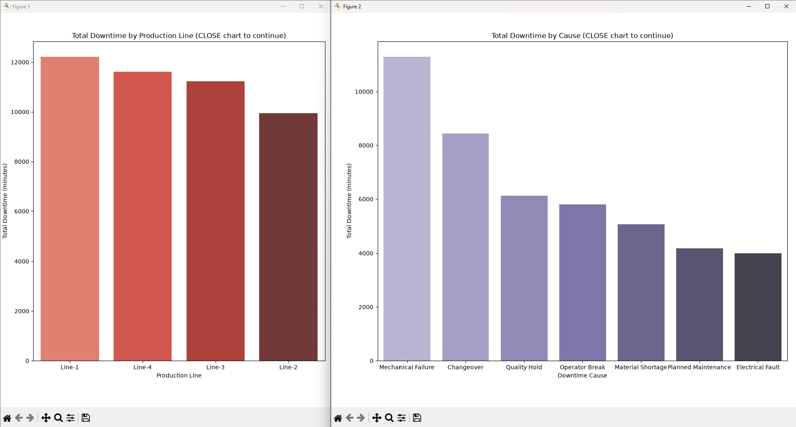

# Project Documentation

This site provides project documentation.
Use the documentation navigation to explore.

## How-To Guide

Many instructions are common to all our projects.

See
[⭐ **Workflow: Apply Example**](https://denisecase.github.io/pro-analytics-02/workflow-b-apply-example-project/)
to get the example projects running on your machine.

## Project Documentation Pages (docs/)

- **Home** - this documentation landing page
- [**Project Instructions**](./project-instructions.md)  - the standard project workflow
- [**Your Files**](./your-files.md) - how to copy the example and create your version
- [**Glossary**](./glossary.md) - project terms and concepts
- [**API**](./api.md) - autogenerated code documentation for the public project interface

## Phase 4. Technical Modification

I added a new module, app_abdel.py, which extends the original example
by aggregating and visualizing sales by PaymentType, a custom attribute
I added to sales_data.csv in an earlier assignment. I chose this change
because it reuses real data I had already added to the project, rather
than inventing a new artificial breakdown. I verified it worked by
running uv run python -m bizintel.app_abdel and confirming a third chart,
Total Sales by Payment Type, was produced alongside the original two
charts, along with a new log line reporting the top payment type and how
many rows were excluded due to missing PaymentType values.

Compared with the example project, the main difference is the addition
of a data-quality-aware aggregation step: rather than assuming every row
has a valid PaymentType, the function explicitly checks for and logs
missing values before grouping. This was a moderate change, since writing
the aggregation itself was straightforward by following the existing
pattern, but adding the missing-value handling required more careful
thought than a simple copy-paste modification.

## Phase 5. Custom Project

For my custom project, I applied the same load, aggregate, visualize,
and log pattern to manufacturing production downtime data instead of
sales data, reflecting my actual work as an engineering team lead in
manufacturing.

### Basis and Data

I created a new dataset, downtime_abdel.csv, containing 505
manufacturing downtime records across 4 production lines, 3 shifts,
and 7 downtime cause categories over a 6 month period. I introduced
intentional data quality issues: a missing downtime cause, missing
and negative downtime durations, and inconsistent casing in the Shift
and DowntimeCause columns. I chose to address missing and negative
duration values and missing cause values directly in the aggregation
functions, and deferred full row-level cleaning, such as permanently
fixing casing issues in the raw file itself, to a future project
phase. My assumption for valid data was that downtime duration must
be a non-negative number and that every record should have both a
production line and a cause to be counted in the cause-level
breakdown.

### Cleaning Approach

I implemented two aggregation functions, downtime_by_line and
downtime_by_cause, following the same load, clean, aggregate, log
pattern as the original example. Each function coerces
DowntimeMinutes to numeric, excludes missing or negative values, and
logs how many rows were excluded and what percentage of the dataset
that represents. downtime_by_cause additionally excludes rows with a
missing DowntimeCause. Both functions also standardize text casing
using str.strip() and str.title() before grouping, so inconsistent
casing in the raw data doesn't fragment a single real category into
multiple near-duplicate bars in the results. I verified the data was
clean enough to trust before saving by checking the warning log
messages after each run to confirm exactly which rows were excluded
and why.

### Before and After

Running the module excluded 2 of 505 downtime rows (0.4%) due to
missing or negative DowntimeMinutes, and 1 row due to a missing
DowntimeCause, before computing the final totals. The resulting
charts showed Line-1 with the highest total downtime at 12,222.7
minutes, and Mechanical Failure as the leading cause at 11,298.7
minutes. Deciding to exclude rather than impute the invalid rows was
a judgment call. I chose exclusion because guessing a replacement
value for a negative or missing downtime duration could distort the
totals in a way that's harder to detect than simply reporting a
smaller, fully valid sample size.

### Summary

Beyond the original example, I implemented a full second analysis
pipeline applied to a different business domain, manufacturing
downtime instead of retail sales, including explicit data quality
handling that logs and excludes invalid records rather than silently
dropping or miscounting them. The prepared output identifies which
production line and which root cause are driving the most lost
production time, which is directly actionable for prioritizing
maintenance and process improvement work. This project reinforced
for me that data quality issues like inconsistent casing or missing
values don't just risk incorrect totals, they can also fragment a
single real category into multiple misleading entries if not handled
before aggregation. Cleaning and preparing data well is what makes
metrics like OEE, downtime by cause, or first-pass yield trustworthy
enough to actually drive engineering decisions.
